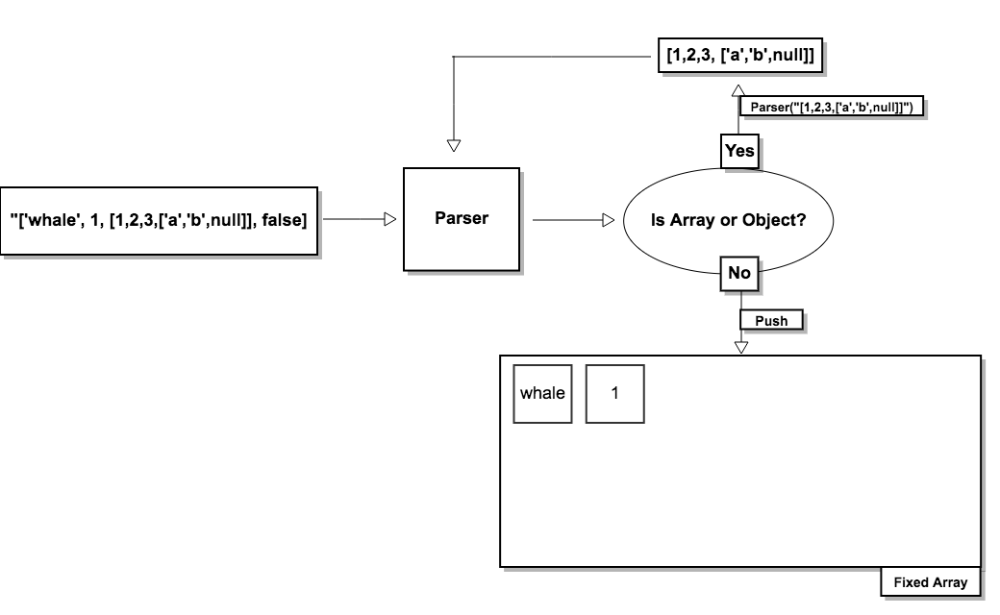
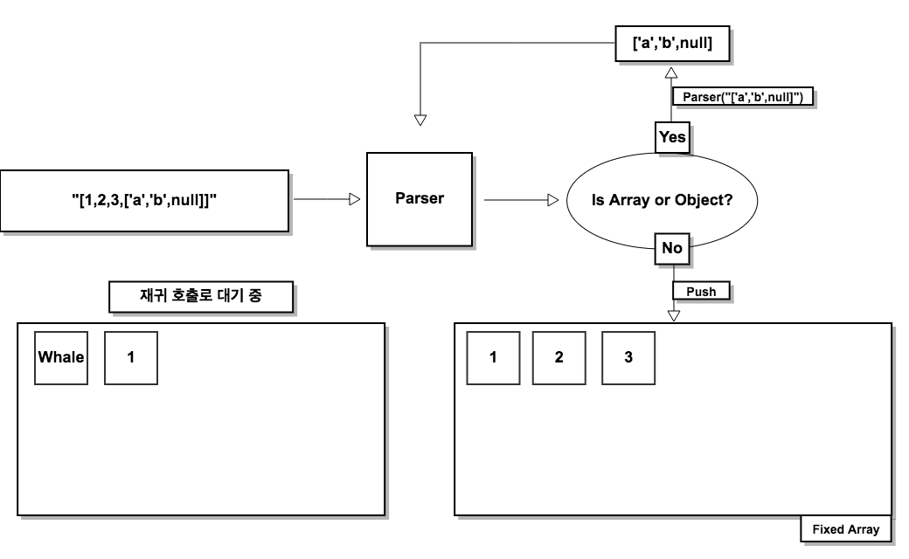
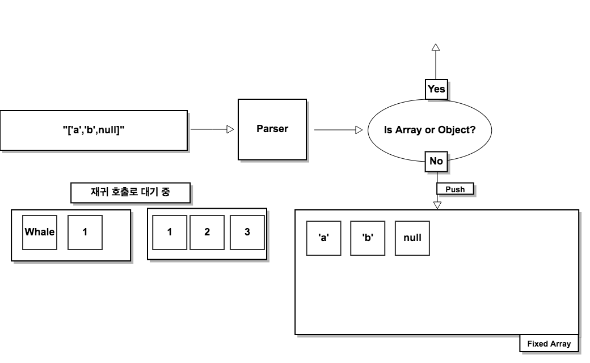
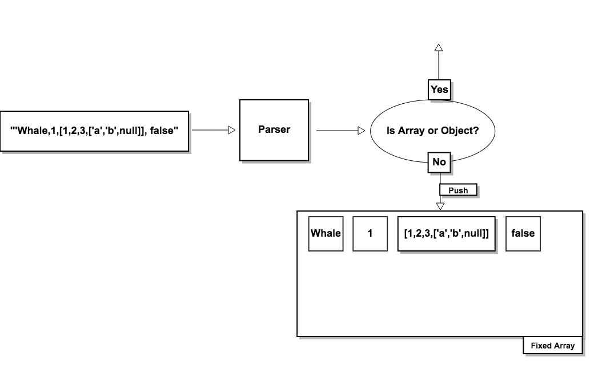
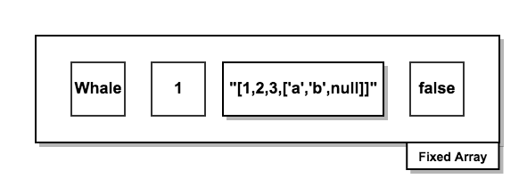

# Array Parser

문자열로 된 배열 **(ex. "[1,2,3]")**을 입력 받고 입력 받은 문자열을 분석하여

새로운 자료구조로 만들어서 반환한다

분석 결과는 아래와 같다

**Input**

```js
"['whale',  1, true]";
```

**Output**

```js
{
  "type": "array",
  "value": "ArrayObject",
  "child": [
    {
      "type": "string",
      "value": "whale",
      "child": []
    },
    {
      "type": "number",
      "value": 1,
      "child": []
    },
    {
      "type": "boolean",
      "value": true,
      "child": []
    }
  ]
}
```

### ArrayParser의 기능

- [[[[]]]]와 같은 다중 중첩배열 구조도 분석할 수 있다

- 7가지 타입을 분석할 수 있다 (Object, Array, String, Number, True, False, Null)
- 문법적 오류가 있다면 검출해낸다 (컴마 없음, 괄호 개수 안맞음, 문자+숫자 혼합과 같은 오류)
- 분석한 배열의 모든 원소의 타입을 체크해 타입별 개수를 출력한다

### Flow

크게 세 가지 과정을 거쳐서 파싱한다

### 1. Arrayer

문자열로 되어 있는 입력값을 배열형태로 만든다

이 과정이 가장 핵심적이며 가장 많은 루프가 돈다


> **분석 Logic**

1. 입력된 문자열을 split('')을 이용해 문자열을 배열로 받아 모든 문자를 처음부터 끝가지 루프를 돌며 분석한다

   ```js
   "['whale',1,null]"
   -> ["[","'","w","h","a","l","e",",","1",",","n","u","l","l","]"]
   ```

2. 문자열 ","를 만나기 전까지 문자열을 계속 누적하며 진행하다가 ","를 만날 때 누적된 문자열을 반환한다
   **여기서 문제가 생긴다** 배열과 객체 타입도 문자열에 포함되어 있기 때문에 배열과 객체 안의 ","를 만나면 "[whale"과 같은 문자열이 만들어지는 것이다

   그래서 배열과 객체는 "["와 "{"가 시작될 때부터 "]"와 "}"로 종료될 때지 분석해서 누적한다 그리고 분석이 완료되어서 하나의 누적 문자열이 탄생할 때에 그 문자열이 배열이나 객체라면 재귀를 이용해 다시 한 번 문자열을 분석한다
   이것은 더이상 배열이나 객체가 없을 때 까지 계속된다

   분석하다가 누적된 문자열이 배열이나 객체일 때에 전체 분석을 멈추고  배열, 객체를 분석을 끝내고 다시 전체 문자열 분석을 시작하는 것이다

   **Parser("['whale',1,[1,2,3,['a','b',nulll]],false]") 분석**



**1. 배열 "[1,2,3,['a','b',null]]"가 완성되었을 때 로직**



**2. "[1,2,3,['a','b',null]]"를 재귀를 이용해 처리한다 배열을 또 완성되면 위와 같이 재귀로 처리**



**3. "['a','b',null]"를 재귀를 이용해 처리한다 더이상 배열이 없어서 재귀가 끝난다**


**4. 완성된 배열 ['a','b',null] 을 리턴한다 **



**5. 완성된 배열 "[1,2,3,['a','b',null]]"를 리턴하고 나머지 원소 false까지 분석하고 마친다**



**6. 완성된 상태**

### 2. Checker

Arrayer과정에서 하나의 원소가 완성될 때에 그 원소에 문법적 오류가 있는지 체크한다

오류가 있으면 에러를 throw한다

에러 체크 내용은 다음과 같다

- '1'23'와 같은 quote 개수 오류
- 123a와 같은 타입 오류
- "[]","{}" 괄호 개수가 맞지 않는 경우 ex) [1,2]]
- 객체 안에서 ":"가 빠진 경우
- quote('')없이 문자열인 경우

### 3. Tokenizer

1번과정(Arrayer)을 거친 배열이 입력된다

입력된 배열의 원소마다 루프를 돌며 객체 자료구조로 매핑한다

자료구조는 다음과 같다

```js
Tokenizer([1,null,'whale'])
->
{ type: 'array'
  value: 'ArrayObject'
  child: 
   [ { type: 'number', value: 1, child: [] },
     { type: 'null', value: null, child: [] },
     { type: 'string', value: 'whale', child: [] } 
    ] 
}
```